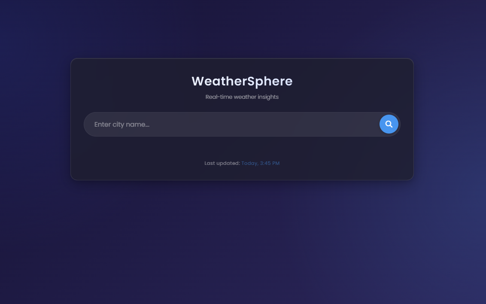
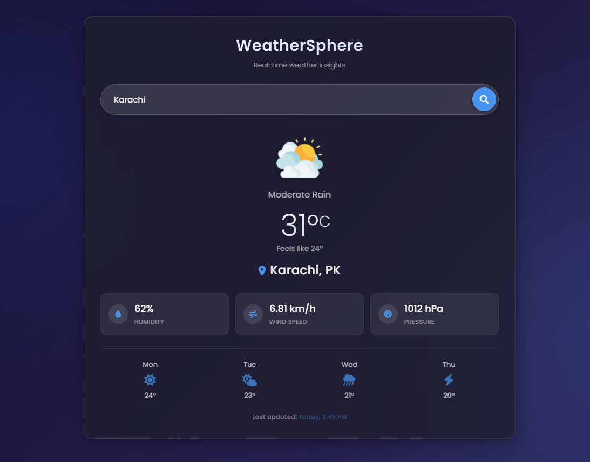

# 🌦️ Weather App

This is a simple yet powerful **Weather App** built with **HTML, CSS, and JavaScript** that fetches real-time weather data using the **OpenWeatherMap API**. Users can search for any city and instantly get updated weather conditions, including temperature, weather status, humidity, and wind speed.

---

## 🚀 Features

- 🌍 Search weather by city name
- 📡 Real-time weather updates from OpenWeatherMap
- 🌡️ Displays temperature in Celsius
- 💨 Shows wind speed and humidity
- 🎯 Clean, responsive user interface
- 🎉 Press `Enter` key or click search button to get results

---

## 📸 Screenshots

| Home                          | Result                        |
| ----------------------------- | ----------------------------- |
|  |  |

---

## 🛠️ Technologies Used

- **HTML5**
- **CSS3**
- **JavaScript (ES6)**
- **OpenWeatherMap API**

